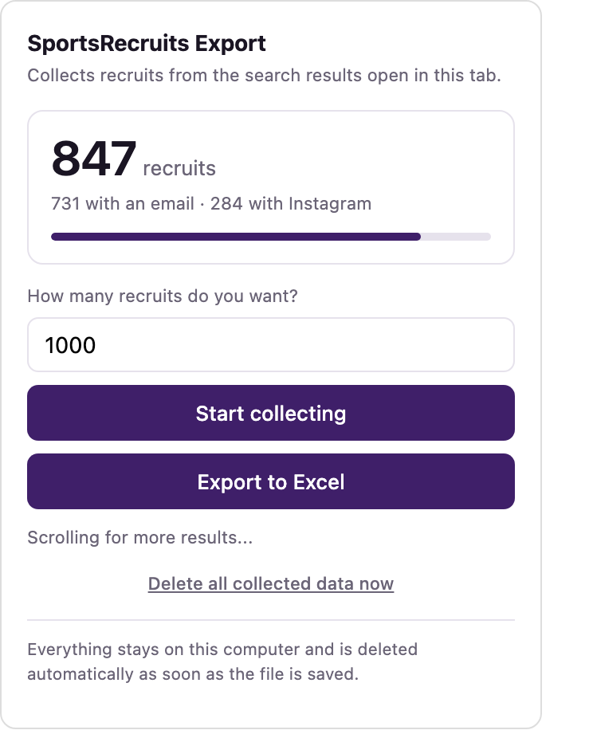
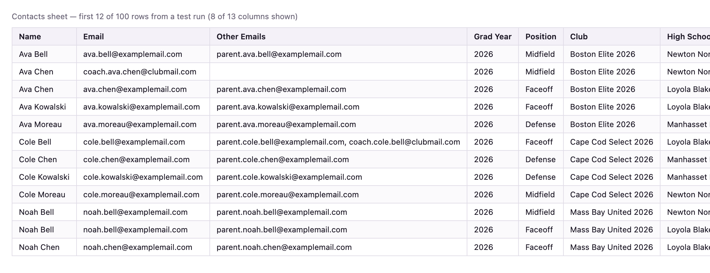
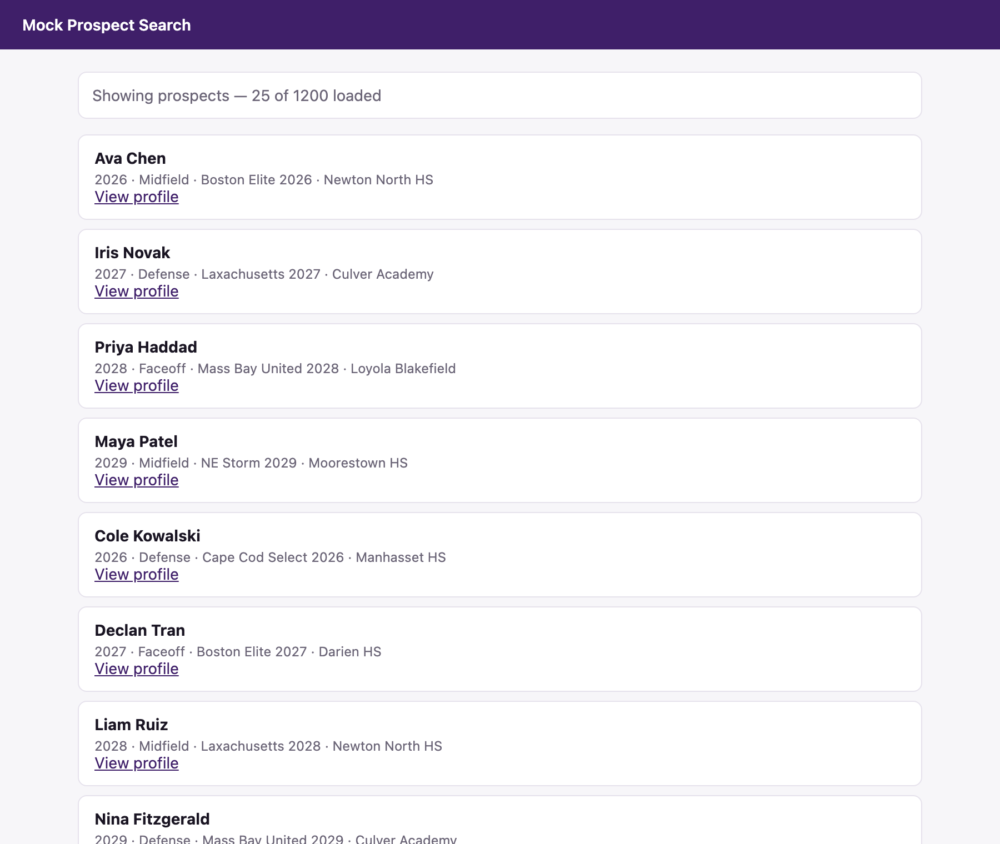

# SportsRecruits Data Extraction & Automation Extension

A credential-free Chrome extension that extracts structured recruiting data from authenticated SportsRecruits sessions and exports native multi-sheet XLSX files entirely in the browser.

The extension does not collect or store user credentials. It runs inside an already authenticated tab, observes the network responses the page is already loading, extracts recruit data, deduplicates records, discovers contact fields, and deletes temporary extension data after export.



## Stack

JavaScript, Chrome Extensions Manifest V3, Fetch/XHR interception, OOXML, ZIP, XLSX

## Engineering highlights

- Runs inside an authenticated SportsRecruits tab without handling account credentials.
- Intercepts `fetch` and `XMLHttpRequest` responses already loaded by the site.
- Uses schema-tolerant extraction instead of depending on fixed API field names.
- Handles pagination, record deduplication, profile enrichment, and contact discovery across email and Instagram fields.
- Generates native multi-sheet XLSX files client-side without external spreadsheet libraries.
- Clears temporary extension storage after export so the downloaded spreadsheet is the only retained copy.
- Includes a local test harness with 1,200 synthetic prospects, multiple pagination styles, decoy objects, and both Fetch and XHR responses.

## How extraction works

The extension injects a small network listener into the active SportsRecruits tab. When the page receives JSON responses, the extension inspects them for person-like records.

Instead of assuming exact property names, the extractor scores objects based on signals such as:

- name
- graduation year
- position
- club or school
- email
- Instagram profile
- stable record ID

This makes the extractor more tolerant of nested objects and changing response shapes.

For example, a response shaped like:

```json
{
  "status": "ok",
  "payload": {
    "prospect": {
      "personal": {
        "name": "Example Recruit"
      }
    }
  }
}
```

must resolve to the prospect record rather than the surrounding payload object or one nested subsection.

## Data pipeline

```text
Authenticated browser tab
        ↓
Fetch / XHR responses
        ↓
Schema-tolerant record extraction
        ↓
Pagination + profile enrichment
        ↓
Deduplication + contact discovery
        ↓
Client-side XLSX generation
        ↓
Temporary extension data deleted
```

## XLSX output

The generated workbook contains three sheets:

- **Contacts** — cleaned recruiting contacts with usable emails prioritized
- **All Data** — every extracted field so source information is not silently dropped
- **Summary** — export-level counts and metadata



The workbook writer is implemented directly in JavaScript using OOXML and ZIP structures. This avoids depending on a remote spreadsheet library, which is incompatible with Manifest V3's extension security model.

## Testing

Because development did not depend on access to a live SportsRecruits account, the repository includes a local mock site with 1,200 synthetic prospects.

The harness covers:

- both Fetch and XHR traffic
- multiple pagination styles
- profile-only email fields
- nested response wrappers
- decoy objects designed to resemble recruit records
- duplicate records across pages
- profile data merged back into search results



The extractor is also checked against several public JSON APIs with different response schemas to verify that it is not coupled to a single hardcoded object structure.

Run the test harness with:

```bash
node test-harness/server.js
```

Then open `http://localhost:8787`.

## Data handling

Temporary data flows through:

```text
Tab memory → Chrome extension storage → downloaded XLSX file
```

After the download completes, the extension clears its temporary stored data. Cleanup is handled by the service worker so it still runs after the popup closes during the browser download flow.

## Install

1. Open Chrome Extensions.
2. Enable Developer mode.
3. Choose **Load unpacked**.
4. Select this repository folder.

See [INSTALL.md](INSTALL.md) for the full setup process.

## Status

The extension is implemented and tested end to end against the included local harness. Live-site behavior may require adjustment if SportsRecruits changes its response or pagination structure.
