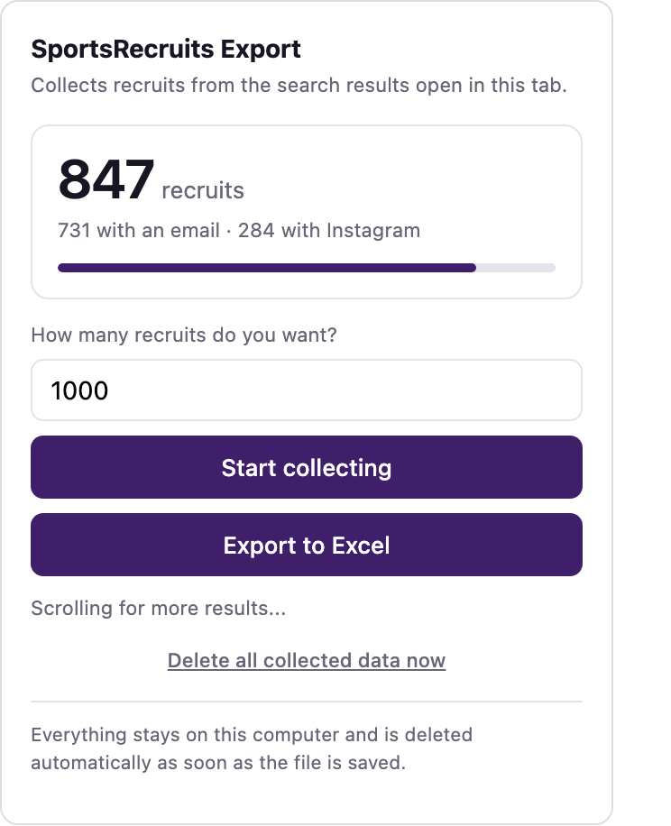
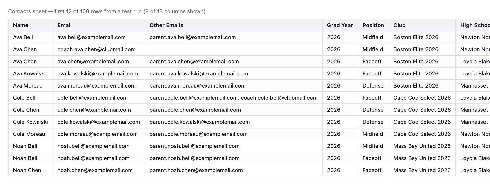
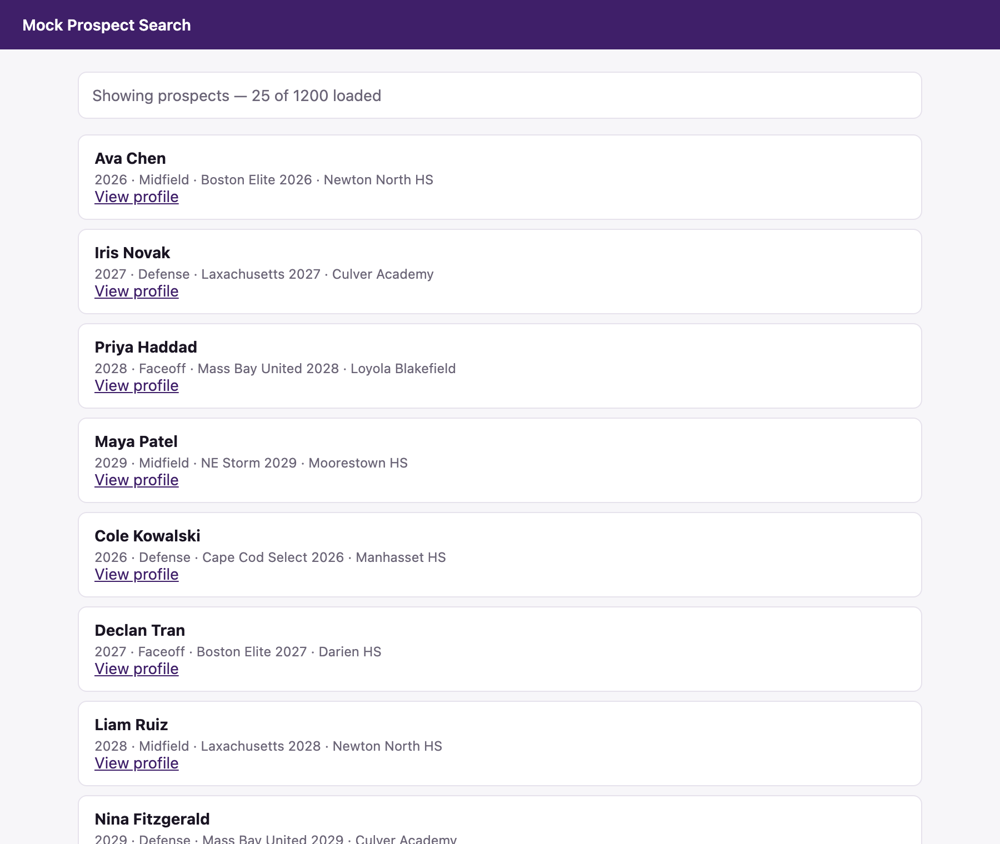

# SportsRecruits Data Extraction & Automation Extension

A credential-free Chrome extension that extracts structured recruiting data from authenticated SportsRecruits sessions and exports native multi-sheet XLSX files entirely in the browser.

The extension does not collect or store user credentials. It runs inside an already authenticated tab, observes the network responses the page is already loading, extracts recruit data, deduplicates records, discovers contact fields, and deletes temporary extension data after export.



Set **Uncommitted** and your desired graduation year on SportsRecruits manually,
wait for results, and press **Start collecting**. The popup's **Maximum athletes
this run** defaults to **500** and accepts 1–10,000. Choose **5** for a diagnostic
live test. Start creates a fresh collection; it does not combine previous filters.
Filters stay manual; there is no graduation-year cycling. The collector also
defaults to 500 when a start message omits its limit. An outdated search tab shows
a reload warning instead of silently running with an old five-athlete cap. While
running, the popup displays the active limit and checked/collected profile counts.

## Stack

JavaScript, Chrome Extensions Manifest V3, Fetch/XHR interception, OOXML, ZIP, XLSX

## Engineering highlights

- Runs inside an authenticated SportsRecruits tab without handling account credentials.
- Intercepts `fetch` and `XMLHttpRequest` responses already loaded by the site.
- Uses schema-tolerant extraction instead of depending on fixed API field names.
- Handles pagination, record deduplication, profile enrichment, and contact discovery across email and Instagram fields.
- Generates native multi-sheet XLSX files client-side without external spreadsheet libraries.
- Clears temporary extension storage after export so the downloaded spreadsheet is the only retained copy.
- Includes a local test harness with 1,200 synthetic prospects, multiple pagination styles, decoy objects, and both Fetch and XHR responses.

## How extraction works

The extension injects a small network listener into the active SportsRecruits tab. When the page receives JSON responses, the extension inspects them for person-like records.

Instead of assuming exact property names, the extractor scores objects based on signals such as:

- name
- graduation year
- position
- club or school
- email
- Instagram profile
- stable record ID

This makes the extractor more tolerant of nested objects and changing response shapes.

For example, a response shaped like:

```json
{
  "status": "ok",
  "payload": {
    "prospect": {
      "personal": {
        "name": "Example Recruit"
      }
    }
  }
}
```

must resolve to the prospect record rather than the surrounding payload object or one nested subsection.

## Data pipeline

```text
Authenticated browser tab
        ↓
Fetch / XHR responses
        ↓
Schema-tolerant record extraction
        ↓
Pagination + profile enrichment
        ↓
Deduplication + contact discovery
        ↓
Client-side XLSX generation
        ↓
Temporary extension data deleted
```

## Collection and profile capture

- `injected.js` retains the original MAIN-world fetch/XHR interception. It reads
  copies of the site's responses without modifying the site's requests.
- `content.js` uses overlapping viewport steps and Load More/Next handling.
  It caches the latest intercepted result list before Start and associates
  candidates with current visible result cards before adding up to the chosen limit.
  Overlapping scroll steps preserve cards in virtualized lists, including middle
  results that jumping straight to the bottom could skip.
- Profile discovery uses the actual View Profile href in the athlete's card,
  then an exact-name link inside that card, then an unambiguous nested
  profile URL/path/href supplied in the athlete JSON. Bare slugs, unrelated
  organization links, external origins and credential-bearing URLs are rejected.
- Each supplied profile URL loads once in a hidden iframe. No HTML prefetch,
  guessed route or generated API template is used. Its own site code makes
  requests intercepted by `injected.js`.
- Managed hidden profiles omit the observed embedded video player. Contact
  capture continues normally. During collection, the search page's video previews
  pause so scrolling does not accumulate dozens of active players. Stop, finish,
  and purge restore their actual URLs with native lazy loading. Idle visible
  profiles keep their previews.
- Managed child frames relay through `chrome.runtime.sendMessage` →
  `background.js` → `chrome.tabs.sendMessage(..., { frameId: 0 })`.
  Children never collect, restore or save records themselves.
- The top frame checks the run's request token, the browser-supplied child frame
  ID and page URL, and the expected athlete ID (plus names if both are present).
  Unmatched payloads do not add athletes or count as profile success.
- Discovery pauses in **20-athlete contact batches**. Emails arrive before the
  full requested limit is discovered; search scrolling pauses while profiles load.
  A finite allowance covers the height of loaded video cards, followed by eight
  quiet ticks. Only newly discovered athletes renew that allowance; scrolling
  alone cannot keep discovery running forever. Only actual
  scrollable result containers are used.
- At most **two** profile frames run concurrently. A matched normalized athlete
  response with its own `emailAddress`, `phoneNumber` and `gpa` fields can finish
  after a 1.2-second settle period when it includes a direct athlete email or
  the child DOM is ready. Matching responses
  and newly discovered DOM mailto addresses restart that period. Repeated unchanged
  widget scans do not delay completion. Partial/unknown schemas retain the
  full **15-second** capture timeout. No email alone triggers early completion.
- Nested fields merge without empty fields erasing captured details. Rendered
  `mailto:` links are attached only after the expected athlete payload matches.
- Repeated search records avoid redundant merges; email/Instagram counts cache
  unchanged records, local saves are batched, and verbose logging is off.


An iframe load event alone is never success. A matching athlete with no captured
email is distinct from a missing URL, mismatched payload, redirected page,
blocked iframe or missing payload. A no-email result describes the captured data;
it does not prove that the site has no email elsewhere.

The live site uses `[data-card-index]` rows with separate
`[data-test-id="firstname"]` and `[data-test-id="lastname"]` spans. Exact unique
combined names associate intercepted records with those rows and their View
Profile links. Generic ID attributes and headings remain supported for the test
site. Ambiguous names are rejected.

Live profiles use `root: {type: "athletes", id}` and a
`resources.athletes[id]` map. The extractor preserves that athlete identity and
resolves only explicitly linked resources, including guardian contacts. It never
uses a nested sport/image ID as the athlete ID.

## Output and privacy

The existing Excel writer produces **Contacts**, **All Data**, and **Summary**.
Contacts puts the profile's direct athlete `emailAddress` first and keeps other
scanned addresses in Other Emails. It includes the actual discovered profile
URL. All Data reserves `_srProfileStatus` and `_srProfileReason` within the
existing 300-column limit. Summary reports omitted columns. Contacts has wide, separate columns, frozen headings and filters. Phone values
are text, preserving leading zeros and international prefixes. GPA uses the
athlete's `gpa.value` and two decimal places, rather than its scale or scaled GPA.
Missing athlete phones remain blank instead of falling back to coach/guardian
phones. All Data also preserves phones/IDs as text and has readable widths.

Bare `instagramHandle` fields are recognized, and the athlete's own handle takes
priority over a coach's handle.



No backend, credential storage or recruit-data transmission is added. Collection
stays in tab memory and Chrome's local extension storage until export. Confirmed
Chrome download completion deletes storage and collection copies in matching
SportsRecruits tabs. Cancellation or a timeout does not count as a successful
save. Stop cancels profile work and checkpoints the collected athletes. If the
page stops answering for 2.5 seconds, the extension worker reloads that tab to
terminate its profile frames and restores the saved collection. Closing the
popup does not cancel Stop; repeated requests share one cancellation. Manual deletion cancels work, pending saves and
cached search data. **Collect emails for these athletes** retries unfinished
profiles from a stopped/restored collection without discarding athletes or already
completed emails. Extension updates preserve unfinished collections; a browser
restart still clears them. After deletion, press Start and reload results manually to
capture a new result list. Chrome restart clears local collection data.

The workbook writer is implemented directly in JavaScript using OOXML and ZIP structures. This avoids depending on a remote spreadsheet library, which is incompatible with Manifest V3's extension security model.

## Testing

Because development did not depend on access to a live SportsRecruits account, the repository includes a local mock site with 1,200 synthetic prospects.

The harness covers:

- both Fetch and XHR traffic
- multiple pagination styles
- profile-only email fields
- nested response wrappers
- decoy objects designed to resemble recruit records
- duplicate records across pages
- profile data merged back into search results



The extractor is also checked against several public JSON APIs with different response schemas to verify that it is not coupled to a single hardcoded object structure.

Run the test harness with:

```bash
node test-harness/server.js
```

Then open `http://localhost:8787`.

## Data handling

Temporary data flows through:

```text
Tab memory → Chrome extension storage → downloaded XLSX file
```

After the download completes, the extension clears its temporary stored data. Cleanup is handled by the service worker so it still runs after the popup closes during the browser download flow.

## Install

1. Open Chrome Extensions.
2. Enable Developer mode.
3. Choose **Load unpacked**.
4. Select this repository folder.

See [INSTALL.md](INSTALL.md) for the full setup process.

After changing extension files, reload the extension and the SportsRecruits tab.
See the [live-test guide](docs/LIVE_TEST.md) for measured results and verification.

```sh
node test-harness/test-unit.js
node test-harness/server.js
```

The mock site at `http://localhost:8787` exercises search, pagination and profile
responses. The 95 regression checks cover correlation, failures, deletion, a 500-athlete
batch with replies arriving out of order, 100 virtualized result cards, and Excel
phone/GPA types and formatting. New checks exercise streaming email collection,
endless scrolling without new athletes, preserving/retrying stopped profiles,
update-safe storage, and bare Instagram handles. Large runs index visible cards
once, reuse scroll containers, coalesce contact scans, and save each finished
profile separately between batch checkpoints. Long scroll jumps are allowed
only when every mounted card's actual profile link has already been captured.
Unknown rows retain overlapping steps. Workbook import and visual
checks also passed. The authenticated five-athlete test on September 26, 2026 matched all five
profiles and captured emails from each. Hidden-frame loading worked in this
session. A stalled 180-athlete collection was also recovered with 179 matched
profiles/direct athlete emails, 106 Instagram handles, and one flagged capture
failure after retries. The saved workbook contains 180 unique athlete IDs and
profile URLs; its phone/GPA types, source values and visible separation were
verified. This recovery was interrupted for updates and does not establish a
fresh-run speed benchmark. Synthetic batch timings do not predict SportsRecruits
throughput. A separate live 40-athlete check reached its requested discovery
count, completed all 40 profiles with zero failures after checkpoint/resume, and
exported 40 matching direct emails, 22 player phones, 39 numeric GPA values and
20 direct Instagram handles. Saving cleared the collection. Keep the search tab
active during collection.

Long collections checkpoint and replace the search tab with a fresh tab after about 60
profile checks, once active frames have settled. This bounds the page's
accumulated profile-navigation load before the observed slowdown near 80.
Completed contacts are restored, the selected filter URL must match exactly,
and discovery continues through already captured rows to find the next recruits.
The replacement keeps the same window, tab position and saved-group membership.
Stop follows the replacement even if requested while it is opening or after the
worker restarts, and clears the automatic continuation. Manual reloads and expired continuation
markers leave the collection idle; no background collection starts later.

The final authenticated fresh run completed 100 recruits with 100 matched
profiles, 100 direct athlete emails, zero failures and no manual retry, within
4½ minutes. It crossed the automatic fresh-tab handoff and continued beyond 80.
The 95 checks also exercise all 500 synthetic athlete/email matches through
multiple transfers. This does not establish a live 500-athlete speed measurement.
